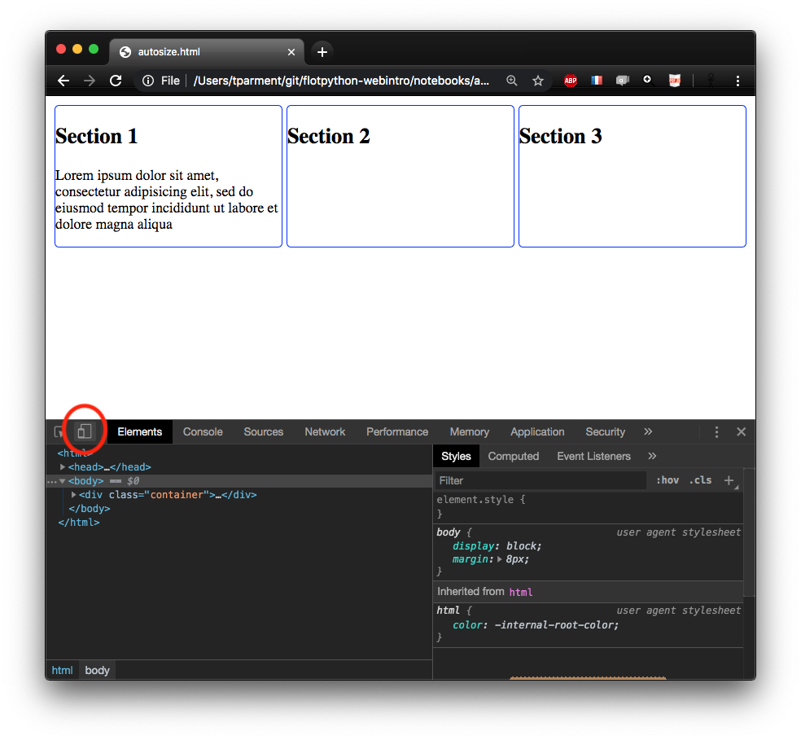
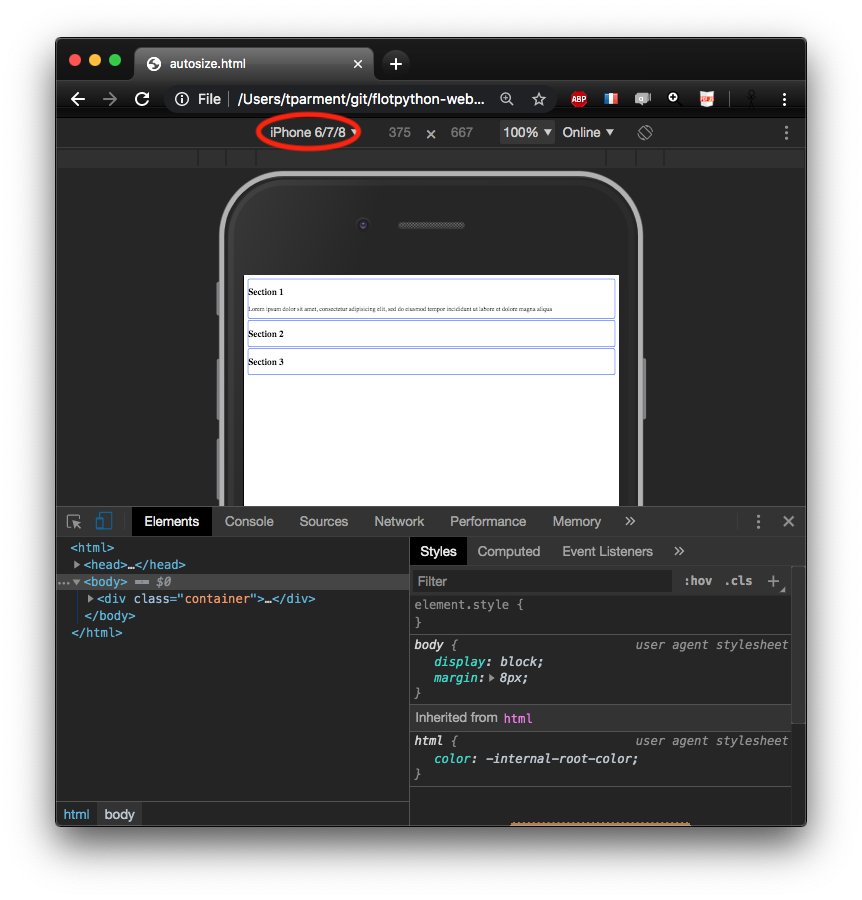

---
jupyter:
  celltoolbar: Slideshow
  jupytext:
    cell_metadata_filter: all,-hidden,-heading_collapsed,-run_control,-trusted
    formats: md
    notebook_metadata_filter: all,-language_info,-toc,-jupytext.text_representation.jupytext_version,-jupytext.text_representation.format_version
    text_representation:
      extension: .md
      format_name: markdown
  kernelspec:
    display_name: Javascript (Node.js)
    language: javascript
    name: javascript
  nbhosting:
    title: grid layout
  rise:
    autolaunch: true
    slideNumber: c/t
    start_slideshow_at: selected
    theme: sky
    transition: cube
---

<div class="licence">
<span>Licence CC BY-NC-ND</span>
<span>Thierry Parmentelat</span>
</div>

<!-- #region slideshow={"slide_type": ""} -->
# `display: grid`
<!-- #endregion -->

```javascript
// run this cell, and then 
// click the created button
tools = require('../js/tools');
tools.init();
```

<!-- #region slideshow={"slide_type": "slide"} -->
## purpose
<!-- #endregion -->

* create grid-based layouts, obviously
* historically a challenging task
  * the `<table>` tag has long been overused  
    to address that sort of needs
  * **do not use** `<table>`'s for that in 2020 !
* `grid` is now available in [all popular modern browsers](https://caniuse.com/#feat=css-grid)

<!-- #region slideshow={"slide_type": "slide"} -->
## example (1)
<!-- #endregion -->

next slide demontrates :

* a proportional grid of [3 rows ⨉ 4 columns]
* with 4 areas defined, based on that tiling
* and 4 `<div>`s that are mapped on these areas
* note the usage of a *grid-specific* length unit
  * `fr` stands for 'free space'
  * so we can allocate fixed or proportional space  
    to some columns (or rows, for that matter)
  * and split the rest proportionally

```javascript hide_input=true slideshow={"slide_type": "slide"}
grid1_html = `<div class="container">
<div class="item-a">the header</div>
<div class="item-b">main area</div>
<div class="item-c">side bar</div>
<div class="item-d">a footer</div>
</div>`;
grid1_css = `.container {
  display: grid;
  grid-template-columns: 
    1fr 1fr 1fr 1fr;
  grid-template-rows: auto;
  grid-template-areas: 
    "header header header header"
    "main main . sidebar"
    "footer footer footer footer";
  height: 100%;
  width: 100%;
}

.item-a {
    grid-area: header;
    background-color: #ffba5a;
}
.item-b {
    grid-area: main;
    background-color: #3282b8;
}
.item-c {
    grid-area: sidebar;
    background-color: #db3056;
}
.item-d {
    grid-area: footer;
    background-color: #7fa998;
}
`;
tools.iframe_html_css("display-grid-1", grid1_html, grid1_css, true)
```

<!-- #region slideshow={"slide_type": "slide"} -->
## example (2)
<!-- #endregion -->

<!-- #region hide_input=true -->
mostly the same, but :

* header and footer have a fixed size
* only change is to replace
  * `grid-template-rows: auto` with
  * `grid-template-rows: 50px 1fr 100px`
  
<!-- #endregion -->

```javascript hide_input=true slideshow={"slide_type": "slide"}
grid2_html = `<div class="container">
<div class="item-a">the header</div>
<div class="item-b">main area</div>
<div class="item-c">side bar</div>
<div class="item-d">a footer</div>
</div>`;
grid2_css = `.container {
  display: grid;
  grid-template-columns: 1fr 1fr 1fr 1fr;
  grid-template-rows: 50px 1fr 100px;
  grid-template-areas: 
    "header header header header"
    "main main . sidebar"
    "footer footer footer footer";
  height: 100%;
  width: 100%;
}

.item-a {
    grid-area: header;
    background-color: #ffba5a;
}
.item-b {
    grid-area: main;
    background-color: #3282b8;
}
.item-c {
    grid-area: sidebar;
    background-color: #db3056;
}
.item-d {
    grid-area: footer;
    background-color: #7fa998;
}
`;
tools.iframe_html_css("display-grid-2", grid2_html, grid2_css, true)
```

<!-- #region slideshow={"slide_type": "slide"} -->
## and much more…
<!-- #endregion -->

* a very good introduction to Grids  
  [can be found on css-tricks.com](https://css-tricks.com/snippets/css/complete-guide-grid/)
* with many illustrations and examples


### assignment


* **strongly recommended** to read thoroughly
* then [complete this game ](https://cssgridgarden.com/)

<!-- #region slideshow={"slide_type": "slide"} -->
## auto-sizing
<!-- #endregion -->

<!-- #region cell_style="split" -->
* a nice feature of grid display
* is its ability to auto-organize the grid
* using an idiom based on
  * `repeat`
  * `auto-fit` 
  * `minmax`
<!-- #endregion -->

<!-- #region cell_style="split" -->
* that we illustrate in the next example  
* see [this doc about minmax()](https://developer.mozilla.org/en-US/docs/Web/CSS/minmax)
* see also [this blogpost on css-tricks.com](https://css-tricks.com/auto-sizing-columns-css-grid-auto-fill-vs-auto-fit/)
<!-- #endregion -->

<!-- #region slideshow={"slide_type": "slide"} -->
## auto-sizing example
<!-- #endregion -->

```javascript hide_input=true
autosize_html = `<div class="container">
  <section> 
    <h1>Section 1</h1>
    <p> Lorem ipsum dolor sit amet, 
consectetur adipisicing elit, sed do
eiusmod tempor incididunt ut labore
et dolore magna aliqua</p> 
  </section>
  <section>
    <h1>Section 2</h1>
  </section>
  <section>
    <h1>Section 3</h1>
  </section>
</div>`;
autosize_css = `section {
  border: 1px solid blue;
  border-radius: 5px;
  margin: 2px;
}

.container {
  display: grid;
  grid-template-columns: 
    repeat(auto-fit, minmax(250px, 1fr));
}`;
tools.iframe_html_css("autosize", autosize_html, autosize_css, true)
```

<!-- #region slideshow={"slide_type": "slide"} -->
## devel tools and multi-device
<!-- #endregion -->

* the devel tools - on chrome at least 
* allow to simulate other devices
* like popular phones and tablets  

<!-- #region slideshow={"slide_type": "slide"} -->

<!-- #endregion -->

<!-- #region slideshow={"slide_type": "slide"} -->

<!-- #endregion -->
