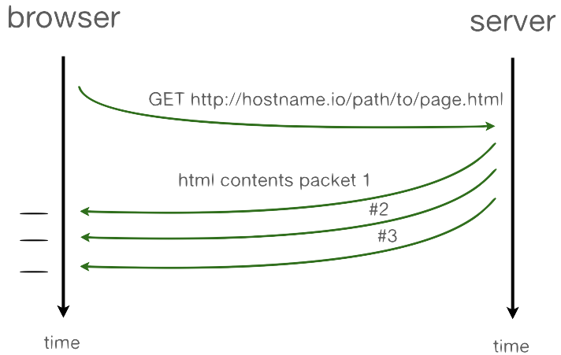
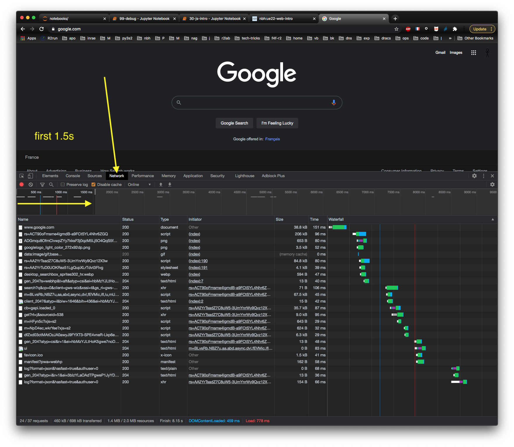

---
jupyter:
  celltoolbar: Slideshow
  jupytext:
    cell_metadata_filter: all,-hidden,-heading_collapsed,-run_control,-trusted
    formats: md
    notebook_metadata_filter: all,-language_info,-toc,-jupytext.text_representation.jupytext_version,-jupytext.text_representation.format_version
    text_representation:
      extension: .md
      format_name: markdown
  kernelspec:
    display_name: Javascript (Node.js)
    language: javascript
    name: javascript
  nbhosting:
    title: js intro
  rise:
    autolaunch: true
    slideNumber: c/t
    start_slideshow_at: selected
    theme: sky
    transition: cube
---

<div class="licence">
<span>Licence CC BY-NC-ND</span>
<span>Thierry Parmentelat</span>
</div>

<!-- #region slideshow={"slide_type": ""} -->
# JavaScript
<!-- #endregion -->

```javascript
tools = require('../js/toolsv2')
tools.init()
```

<!-- #region slideshow={"slide_type": "slide"} -->
## the missing piece
<!-- #endregion -->

JavaScript comes in addition to

* HTML for **content**
* CSS for **style**

JavaScript

* it is a full-fledged **programming language** 
* and provides for **behaviour**

<!-- #region slideshow={"slide_type": "slide"} -->
## JavaScript characteristics
<!-- #endregion -->

* runs **inside the browser**
* has direct **access to the DOM**
* that it can freely manipulate to  
  add / remove / modify content  
  dynamically change properties
* in response to user-triggered events

<!-- #region slideshow={"slide_type": "slide"} -->
## example 1
<!-- #endregion -->

in this example :

* HTML has two elements
* one acts as a button, that can make  
  the other one visible or not
* for that we create a JavaScript  
  **function** named `toggle()`
* that is bound to the `onclick` event   
  of the button element

```javascript scrolled=false slideshow={"slide_type": "slide"} hide_input=true
tools.from_samples("30-js-intro-example-00", 
                   {width: '30em', height: '25em', separate_show: true})
```

<!-- #region slideshow={"slide_type": "slide"} -->
#### things to note about example #1  

visibility of symbols (variable and function names) :

* `onclick` property on `button`  
  is a JavaScript fragment  
  that refers to global `toggle` function
* local variables inside `toggle`  
  are declared with `let`
* global variables `document` and `console`  
  allow to access browser components
<!-- #endregion -->

<!-- #region slideshow={"slide_type": "slide"} hide_input=true -->
## example 2
<!-- #endregion -->
in this further example :

* we create two visible elements:   
  a button, and a graphic area `<svg>`
* the page runs a cyclic task  
  that adds a random point 
* button to start / suspend

```javascript hide_input=true slideshow={"slide_type": "slide"}
tools.from_samples("30-js-intro-example-randomdots",
                   {width: '35em', height: '20em', 
                    min_width: '15em', separate_show: true})
```

<!-- #region slideshow={"slide_type": "slide"} -->
#### things to note about example #2 :

* adding to the DOM to create new content  
  (createElementNS and append)
* `the_board` is a JavaScript *object*    
  i.e. composite data keyed on `w`, `h`, etc…  
  (more on this later)
<!-- #endregion -->

<!-- #region slideshow={"slide_type": "slide"} -->
#### still on example #2 :

and also, about asynchronicity :

* initialization code messes with the `<svg>`'s attributes 
  * so, the `<svg>` element must have been created **beforehand**
* **but** 
  * a page is made of html + css + js 
  * we have no control on the order  
    in which things happen in the browser
* how to ensure that init code is executed  
  **after** html elements are created ?
  * the purpose of `document.onload`
<!-- #endregion -->

<!-- #region slideshow={"slide_type": "slide"} -->
## page loading
<!-- #endregion -->

### reminder : a few orders of magnitude

* CPU + memory : 1 ns
* storage :
  * SDD : 100 µs
  * HDD : 1-10 ms
* networking :
  * light-speed Paris-SF : 30 ms
  * light-speed Paris-Nice : 3 ms
  * plus, software stack traversals
  * plus, protocols = several back and forths
  * bottom line: more in the **several 100s of ms**
  * frequently several seconds

<!-- #region slideshow={"slide_type": "slide"} -->
### a simple page
<!-- #endregion -->

<!-- #region cell_style="split" -->
when loading the simplest possible page, contents get scattered into packets, so it does not arrive all at once
<!-- #endregion -->

<!-- #region cell_style="split" -->

<!-- #endregion -->

<!-- #region slideshow={"slide_type": "slide"} -->
### a page and a nested page
<!-- #endregion -->

<!-- #region cell_style="split" -->
in the case of a page  
that has a nested page  
(e.g. a css style)  
there are 2 http requests at work
<!-- #endregion -->

<!-- #region cell_style="split" -->

<!-- #endregion -->

<!-- #region slideshow={"slide_type": "slide"} -->
### loading a real page
<!-- #endregion -->



<!-- #region slideshow={"slide_type": "slide"} -->
## event-driven
<!-- #endregion -->

* as opposed to more traditional languages,  
  (think `main()` in C++ or Java,  
   or the entry module in Python)  
* browser-hosted code has  
  **little control** on overall **order**  
* plus, apps need to **react to events** that can be  
  * **user-**triggered (clicking, ...)
  * **network-**triggered (a page finished loading)
  * or **time-**triggered - some cyclic task is scheduled

<!-- #region slideshow={"slide_type": "slide"} -->
## callbacks
<!-- #endregion -->

* one very pervasive programming pattern in JavaScript 
* is the notion of a **callback** 
* which is a **function**
* attached to some sort of **event**
* and then of course the function  
  gets fired when event occurs

<!-- #region slideshow={"slide_type": "slide"} -->
## callbacks - continued
<!-- #endregion -->

in our 2 examples, we have seen 3 callbacks already

* ex.1 : `onclick="toggle()"`  
* ex.2 : `setTimeout(() => this.run(), 500)` 
* ex.2 : `window.onload = function () { ` 

<!-- #region slideshow={"slide_type": "slide"} -->
## take home message
<!-- #endregion -->

as far as Web frontend, JavaScript :

* runs **in the browser**  <span style="font-size: small">(FYI can also be used as a regular programming language)</span>
* **full-fledged** modern language, with objects, modules…
* aware of browser objects through globals  
  e.g. `document`, `window`, `console`
* highly influenced by **asynchronicity**
