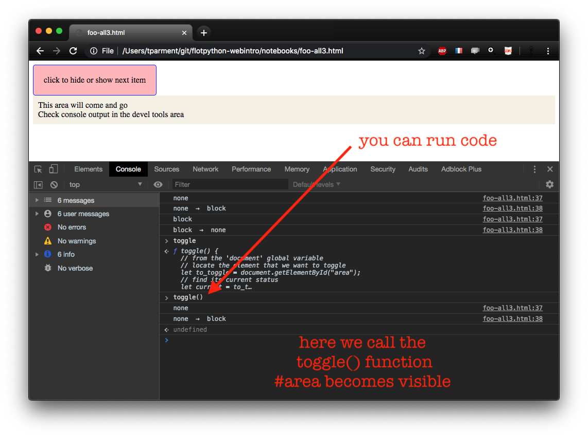
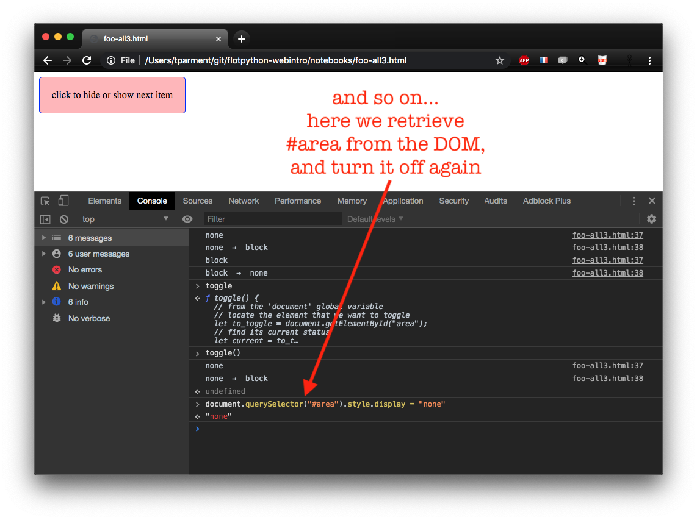
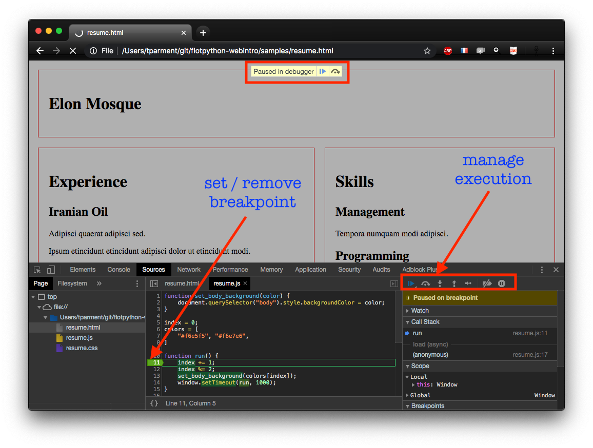

---
jupyter:
  celltoolbar: Slideshow
  jupytext:
    cell_metadata_filter: all,-hidden,-heading_collapsed,-run_control,-trusted
    formats: md
    notebook_metadata_filter: all,-language_info,-toc,-jupytext.text_representation.jupytext_version,-jupytext.text_representation.format_version
    text_representation:
      extension: .md
      format_name: markdown
  kernelspec:
    display_name: Javascript (Node.js)
    language: javascript
    name: javascript
  nbhosting:
    title: practice & devel tools
  rise:
    autolaunch: true
    slideNumber: c/t
    start_slideshow_at: selected
    theme: sky
    transition: cube
---

<!-- #region slideshow={"slide_type": "slide"} cell_style="split" -->
<div class="licence">
<span>Licence CC BY-NC-ND</span>
<span>Thierry Parmentelat</span>
</div>
<!-- #endregion -->

<!-- #region slideshow={"slide_type": ""} -->
# practice
<!-- #endregion -->

```javascript
tools = require('../js/toolsv2')
tools.init()
```

<!-- #region slideshow={"slide_type": ""} -->
in this notebook :

* a simple assignment
* plus a few tips to get started
* **make sure you read this notebook thoroughly before you start**
<!-- #endregion -->

<!-- #region slideshow={"slide_type": "slide"} -->
## assignment

* create a HTML document as a collection of 3 files, 
* say : `resume.html`, `resume.css`, `resume.js`
* make sure the html `<head>` loads **both** the css and js companions
<!-- #endregion -->

<!-- #region cell_style="split" -->
* then edit the JavaScript code
* so that the background color  
  changes every second
* between 2 different colours
<!-- #endregion -->

<!-- #region slideshow={"slide_type": "notes"} cell_style="split" -->
* let's first see an example
* and then **a few tips**   
  that should come in handy
<!-- #endregion -->

```javascript slideshow={"slide_type": "slide"} hide_input=true
tools.from_samples("resume", {separate_show: true, sources_show: false})
```

<!-- #region slideshow={"slide_type": "slide"} -->
## tip #1 : run code upon load

<!-- #endregion -->

<!-- #region slideshow={"slide_type": ""} -->
so, you want to run some code, say call function `start()`   
right when the page has **finished loading**  
**BUT** it is **unsafe** to do something like 

```html
<script src="thecode.js"></script>

<script>
start('some-data')
</script>
```

because at the time when `start('some-data')` gets executed,  
your page is still in the middle of the loading phase  
(even though that might accidentally work just fine)
<!-- #endregion -->

<!-- #region slideshow={"slide_type": "slide"} -->
### run code upon load : the proper way
<!-- #endregion -->

<!-- #region -->
the proper way is to attach a **callback**  
to the page **`load`** event

```javascript
// attach an (anonymous) function to the 'load' event
window.addEventListener(
    'load', function() { start('some-data'))

// OR, same but a little nicer, with an arrow function
window.addEventListener(
    'load', () => start('some-data'))
```

this time, `start()` will get **called later**  
at a time where you can be sure the document is entirely **loaded**
<!-- #endregion -->

<!-- #region slideshow={"slide_type": "slide"} -->
## digression : variable declaration with `let`
<!-- #endregion -->

in your code, make sure you **always** declare your local variables with either
* `let x = 10` or `const y = 10`


there is also an old-style variable declaration  
**DO NOT** use `var` in your code !

* `var old_school_declaration`


<div style="color:blue; font-size: 80%">
    
however **in the context of the notebook**, we will often **skip declarations** altogether  
so that cells can be evaluated twice (`let` or `const` can only be used once)
    
</div>    

<!-- #region slideshow={"slide_type": "slide"} -->
## tip #2 : implement a cyclic task
<!-- #endregion -->

implementing a cyclic task was done in example 2 already  
as a reminder: based on `setInterval()`  
(you may use clearInterval to cancel)

```javascript cell_style="split"
// so that we can stop the running loop
// make sure you use 'let' in your code
/*let*/ active = true;

function one_step() {
    if (active)
        console.log("beep");
}

// again, this should comes with a 'let'
/*let*/ interval = setInterval(one_step, 2000)
```

```javascript cell_style="split"
// note that our JS interpreter 
// is still responsive
// we can stop the endless loop
active = false
```

```javascript cell_style="split"
// it's also possible to stop it
// altogether
active = true
clearInterval(interval) 
```

<!-- #region slideshow={"slide_type": "slide"} -->
### observations on cyclic tasks
<!-- #endregion -->

in a traditional language one would maybe consider writing something like 

<!-- #region cell_style="split" -->
```python
while True:
    if active:
        one_step()
    sleep 1
```    
<!-- #endregion -->

<!-- #region cell_style="split" -->
note however that with such an approach, the Python interpreter remains busy, it **can't do anything else** at the same time
<!-- #endregion -->

<!-- #region slideshow={"slide_type": "slide"} -->
## tip #3 : use devel tools
<!-- #endregion -->

* crucially important to get familiar with these tools  
*  starting with the most useful ones :
  * *Elements*
  * *Console*
  * and to a lesser extent, *Sources*


<!-- #region slideshow={"slide_type": "slide"} -->
### Devel Tools : *Elements*
<!-- #endregion -->

as mentioned earlier already, you can

* navigate the DOM
* '*Inspect* ' an element (find an element from a position in the page)
* see the CSS rules that apply to an element 
* find out where these styles come from
* see the computed values for each property
* interactively change a property and  
  see effect immediately (shown on next slide)

<!-- #region slideshow={"slide_type": "slide"} -->
### visualizing a changed property
<!-- #endregion -->


<!-- #region slideshow={"slide_type": "slide"} -->
### Devel Tools : the *Console* REPL 
<!-- #endregion -->

* the place where lands the output of `console.log`  
  of course quite useful for naive debugging
* and there you **can run JavaScript** on the fly  
  much like the Python interpreter does  
* known as a REPL ( = Read Eval Print Loop)
* illustrated in the following slides

<!-- #region slideshow={"slide_type": "slide"} -->

<!-- #endregion -->

<!-- #region slideshow={"slide_type": "slide"} -->

<!-- #endregion -->

<!-- #region slideshow={"slide_type": "slide"} -->

<!-- #endregion -->

<!-- #region slideshow={"slide_type": "slide"} -->

<!-- #endregion -->

<!-- #region slideshow={"slide_type": "slide"} -->
### Devel Tools : *Sources*
<!-- #endregion -->
<!-- #region cell_style="split" -->
* occasionnally useful to browse the code actually loaded

<!-- #endregion -->

<!-- #region cell_style="split" -->

<!-- #endregion -->

<!-- #region slideshow={"slide_type": "slide"} -->
### Devel Tools : debugger
<!-- #endregion -->

<!-- #region cell_style="split" -->
* the *Sources* tab has buit-in debugging features
<!-- #endregion -->

<!-- #region cell_style="split" -->

<!-- #endregion -->

<!-- #region slideshow={"slide_type": "slide"} -->
## more on devel tools
<!-- #endregion -->

<!-- #region slideshow={"slide_type": ""} -->
* there are standard keyboard shortcuts to invoke devel tools,  
* e.g. for [google chrome](https://developers.google.com/web/tools/chrome-devtools/shortcuts)  
  * macOS `⌘ ⌥ J` (console) or `⌘ ⌥ I` (your last tab)
  * others `⌃ ⇧ J` (console) or `⌃ ⇧ I` (your last tab)
* a bit early for now, but be aware that  
  they come with a complete debugger
* do not hesitate to search for some hands-on / video tuto
<!-- #endregion -->

<!-- #region slideshow={"slide_type": "slide"} -->
## the browser cache (yet again)
<!-- #endregion -->

* the browser cache thing (see CSS loading)
* applies exactly the same  
* in the case of JavaScript code

**Remember**

* to use Shift-load, or other cache-cleaning tool  
* if changes in a file do not seem to kick in
